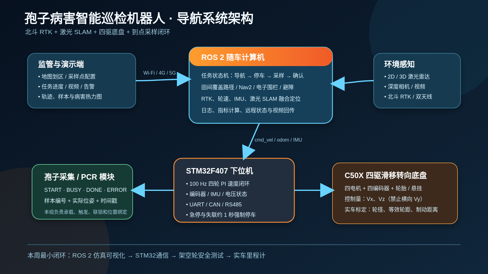
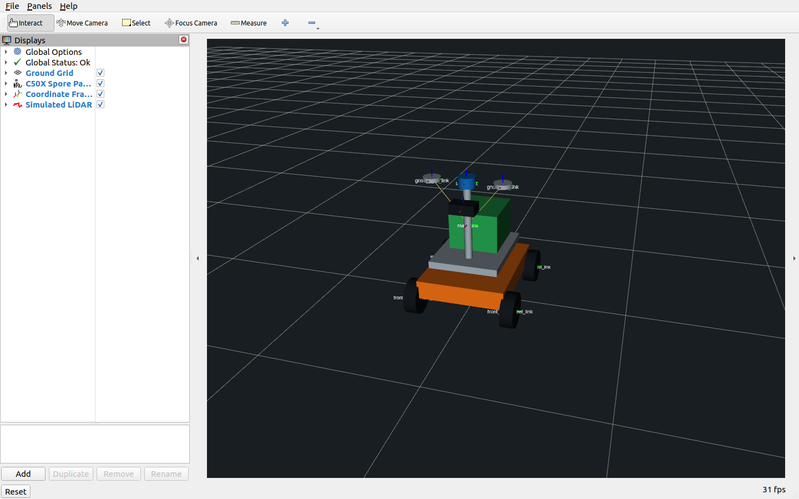
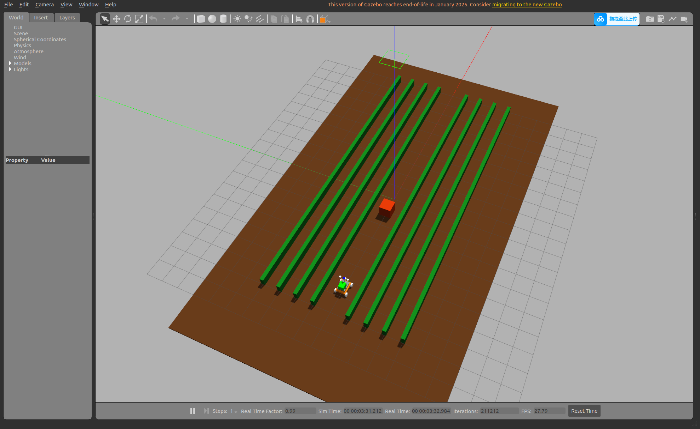

# Spore Patrol Robot

面向“基于机器人与 DNA-PCR 技术的孢子病害识别”项目的机器人导航工作区。

当前目标是在 WHEELTEC C50X 四驱滑移转向底盘和 STM32F407 下位机基础上，逐步实现：

- C50X 机器人模型与 ROS 2 坐标系；
- Gazebo 农田场景和二维激光雷达仿真；
- STM32 串口/CAN 底盘驱动；
- 轮速、IMU、北斗 RTK 与激光 SLAM 融合定位；
- 田间覆盖路径规划、电子围栏和动态避障；
- “到点—停车—采样—确认—继续”的任务状态机；
- 运行日志、测试数据和比赛演示材料。

## 当前成果

- `spore_patrol_description`：C50X 四驱底盘简化 Xacro 模型；
- `spore_patrol_sim`：简化农田世界、激光雷达和可移动机器人；
- `spore_patrol_bringup`：统一演示启动入口；
- `docs/system_architecture.svg`：汇报用系统架构图（同时提供 PNG）；
- `docs/evening_brief.md`：阶段汇报提纲。

> 当前模型采用固件中“顶配摆式悬挂四驱”参数作为临时值：半轮距 0.311 m、半轴距 0.308 m、轮径 0.225 m。拿到实车后必须根据底盘挡位和实测尺寸更新。

### 可视化结果

系统总体方案：



机器人 RViz 模型：



Gazebo 农田场景：



### 已验证接口

演示启动后已经验证以下 ROS 2 接口可用：

- `/cmd_vel`：底盘速度控制；
- `/odom`：仿真里程计；
- `/scan`：二维激光雷达，当前约 9.9 Hz；
- `/joint_states`、`/tf`、`/tf_static`：机器人关节和坐标变换；
- `/robot_description`：机器人模型描述。

当前 Gazebo 运动插件用于今晚的系统链路和界面演示，还不代表真实四驱滑移转向动力学，也尚未接入 Nav2 自主导航。

## 环境

- Ubuntu 22.04
- ROS 2 Humble
- Gazebo Classic 11

## 编译

```bash
cd spore_patrol_ws
source /opt/ros/humble/setup.bash
colcon build --symlink-install
source install/setup.bash
```

## RViz 模型展示

```bash
ros2 launch spore_patrol_description display.launch.py
```

## Gazebo 农田演示

```bash
ros2 launch spore_patrol_bringup demo.launch.py
```

另开终端控制：

```bash
source /opt/ros/humble/setup.bash
source install/setup.bash
ros2 run teleop_twist_keyboard teleop_twist_keyboard
```

## 工作区规划

```text
src/
├── spore_patrol_description   机器人结构、URDF/Xacro、RViz
├── spore_patrol_sim           Gazebo世界和仿真启动
└── spore_patrol_bringup       系统一键启动与参数入口

后续新增：
├── spore_patrol_base_driver   STM32串口/CAN协议
├── spore_patrol_localization  轮速/IMU/RTK/SLAM融合
├── spore_patrol_navigation    Nav2规划、控制和避障
├── spore_patrol_coverage      田间覆盖路径
└── spore_patrol_mission       采样任务状态机
```

## 安全原则

- 真实底盘首次测试必须架空车轮；
- 上位机速度指令中断约 1 秒后，STM32 必须强制停车；
- 自动模式必须保留独立硬件急停；
- 仿真参数不能直接视为实车标定结果；
- 定位、路径、续航等比赛指标只使用真实可追溯数据。
